# Digital Warranty Vault - Architecture Diagram

## System Architecture Overview

```mermaid
graph TB
    subgraph Client["🖥️ CLIENT LAYER"]
        subgraph Frontend["React Frontend (Vite)"]
            Pages["📄 Pages<br/>Dashboard • LoginPage<br/>RegisterPage • AddWarranty<br/>EditWarranty • Profile<br/>WarrantyList • LandingPage"]
            Components["🧩 Components<br/>Navbar • Card • Button<br/>Badge • FileUploadZone<br/>NotificationBell • QRCodeModal<br/>OCRIndicator • Sidebar"]
            Services["🔧 Services<br/>authService<br/>warrantyService<br/>notificationService<br/>API Client"]
            Context["🔐 State Management<br/>AuthContext"]
        end
    end

    subgraph API["⚙️ API LAYER - Django REST Framework"]
        Router["🛣️ URL Router<br/>warranty_vault/urls.py"]
        
        subgraph Users["👤 Users App"]
            U_Views["Views: Auth<br/>Profile • Login<br/>Register"]
            U_Models["Models:<br/>User"]
            U_Serializers["Serializers:<br/>UserSerializer"]
        end
        
        subgraph Warranties["📋 Warranties App"]
            W_Views["Views: List<br/>Create • Retrieve<br/>Update • Delete<br/>Share • PublicView"]
            W_Models["Models:<br/>Warranty<br/>WarrantyShare"]
            W_Services["Services:<br/>OCR Processing<br/>File Handling<br/>Share Token Gen"]
        end
        
        subgraph Notifications["🔔 Notifications App"]
            N_Views["Views: List<br/>Mark as Read<br/>Preferences"]
            N_Models["Models:<br/>Notification<br/>NotificationPref"]
            N_Services["Services:<br/>Email Alerts<br/>Expiry Checks<br/>Background Tasks"]
        end
    end

    subgraph Data["💾 DATA LAYER"]
        Database["🗄️ SQLite Database<br/>users_user • warranties_warranty<br/>warranties_warrantyshare<br/>notifications_notification<br/>notifications_notificationpref"]
        Media["📁 Media Storage<br/>receipts/ • documents/"]
    end

    subgraph External["🌐 EXTERNAL SERVICES"]
        OCR["🔍 OCR Service<br/>Document Scanning<br/>Text Extraction"]
        Email["📧 Email Service<br/>Notifications<br/>Alerts & Reminders"]
        QR["⚡ QR Code Generator<br/>Share Links"]
    end

    Pages --> Context
    Components --> Context
    Services --> Context
    Context -->|HTTP/HTTPS REST API| Router
    Router --> Users
    Router --> Warranties
    Router --> Notifications
    
    U_Views --> U_Models
    U_Views --> U_Serializers
    W_Views --> W_Models
    W_Views --> W_Services
    Warranties --> OCR
    Warranties --> QR
    N_Views --> N_Models
    N_Views --> N_Services
    
    Users --> Database
    Warranties --> Database
    Notifications --> Database
    Warranties --> Media
    N_Services --> Email
    
    style Client fill:#e1f5ff
    style API fill:#f3e5f5
    style Data fill:#e8f5e9
    style External fill:#fff3e0
```

## External Services & Integration Points

```mermaid
graph LR
    subgraph Services["🌐 External Services"]
        OCR["🔍 OCR Service<br/>━━━━━━━━━━<br/>• Document Scanning<br/>• Text Extraction<br/>• Warranty Parsing<br/>• Data Validation"]
        Email["📧 Email Service<br/>━━━━━━━━━━<br/>• Expiry Notifications<br/>• Alert Reminders<br/>• Password Reset<br/>• Share Invites"]
        QR["⚡ QR Generator<br/>━━━━━━━━━━<br/>• Warranty Links<br/>• Public Access URLs<br/>• Share Tokens"]
    end
    
    Warranty["📋 Warranties<br/>Module"]
    Notification["🔔 Notifications<br/>Module"]
    
    Warranty --> OCR
    Warranty --> QR
    Notification --> Email
    
    style Services fill:#fff3e0,stroke:#ff9800,stroke-width:2px
```

## Data Flow Diagram

```mermaid
sequenceDiagram
    participant User as 👤 User
    participant Frontend as 🖥️ Frontend
    participant API as ⚙️ Backend API
    participant OCR as 🔍 OCR Service
    participant DB as 💾 Database
    participant Email as 📧 Email Service
    
    User->>Frontend: Uploads Document
    Frontend->>API: POST /warranties/upload
    API->>API: Validate File
    API->>DB: Store File Reference
    API->>OCR: Extract Document Data
    OCR-->>API: Return Parsed Data
    API->>DB: Create Warranty Record
    API->>DB: Create Notification Record
    API->>Email: Send Confirmation Email
    Email-->>User: Email Sent ✓
    API-->>Frontend: Success Response
    Frontend-->>User: Display Warranty Details
    
    Note over API,Email: Expiry Check (Background Job)
    API->>DB: Query Expiring Warranties
    DB-->>API: Return Warranties < 30 Days
    API->>Email: Send Expiry Reminder
    Email-->>User: Reminder Email 📬
```

## Key Components

### Frontend Architecture

```mermaid
graph TB
    subgraph React["React Frontend (Vite)"]
        subgraph State["🔐 State Management"]
            Auth["AuthContext<br/>• User Auth<br/>• Session<br/>• Token"]
        end
        
        subgraph Pages["📄 Pages"]
            P1["Dashboard"]
            P2["LoginPage"]
            P3["RegisterPage"]
            P4["WarrantyList"]
            P5["AddWarranty<br/>EditWarranty<br/>Profile"]
        end
        
        subgraph Components["🧩 UI Components"]
            C1["Navbar"]
            C2["Sidebar"]
            C3["Card"]
            C4["Button"]
            C5["FileUploadZone"]
            C6["NotificationBell<br/>NotificationDropdown"]
            C7["QRCodeModal<br/>Badge"]
        end
        
        subgraph Services["🔧 API Services"]
            S1["authService.js<br/>Login • Register<br/>Token Management"]
            S2["warrantyService.js<br/>CRUD • Upload<br/>Share"]
            S3["notificationService.js<br/>Fetch • Mark Read"]
            S4["API Client<br/>HTTP Request Handler"]
        end
        
        subgraph Utils["⚙️ Utilities"]
            U1["utils.js<br/>Helpers & Formatters"]
        end
        
        Auth --> Pages
        Auth --> Components
        Pages --> Components
        Pages --> Services
        Components --> Services
        Services --> S4
    end
    
    style React fill:#e1f5ff,stroke:#0288d1
    style State fill:#bbdefb
    style Pages fill:#c3e9ff
    style Components fill:#b3e5fc
    style Services fill:#81d4fa
```

### Backend Architecture

```mermaid
graph TB
    subgraph Django["Django REST Framework"]
        subgraph Apps["📦 Core Applications"]
            Users["👤 Users App<br/>━━━━━━━━<br/>Auth • Registration<br/>Profile Management"]
            Warranties["📋 Warranties App<br/>━━━━━━━━<br/>CRUD • OCR<br/>Sharing • QR Links"]
            Notifications["🔔 Notifications App<br/>━━━━━━━━<br/>Alerts • Reminders<br/>Preferences"]
        end
        
        subgraph Components["🛠️ Core Components"]
            Views["📍 Views<br/>REST Endpoints"]
            Models["🗂️ Models<br/>ORM Objects"]
            Serializers["🔄 Serializers<br/>JSON Conversion"]
            Services["⚙️ Services<br/>Business Logic"]
        end
        
        Users --> Views
        Users --> Models
        Users --> Serializers
        
        Warranties --> Views
        Warranties --> Models
        Warranties --> Serializers
        Warranties --> Services
        
        Notifications --> Views
        Notifications --> Models
        Notifications --> Serializers
        Notifications --> Services
    end
    
    style Django fill:#f3e5f5,stroke:#7b1fa2
```

### Database Design

